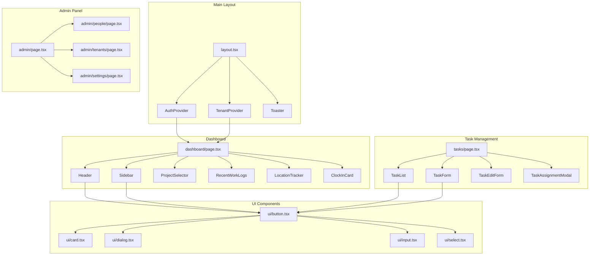
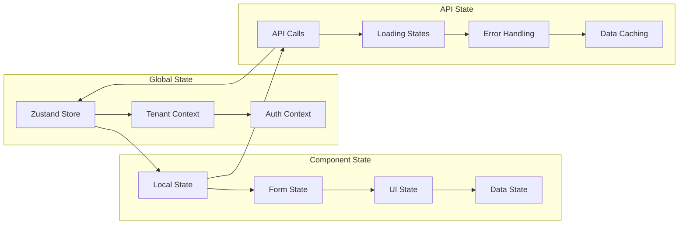
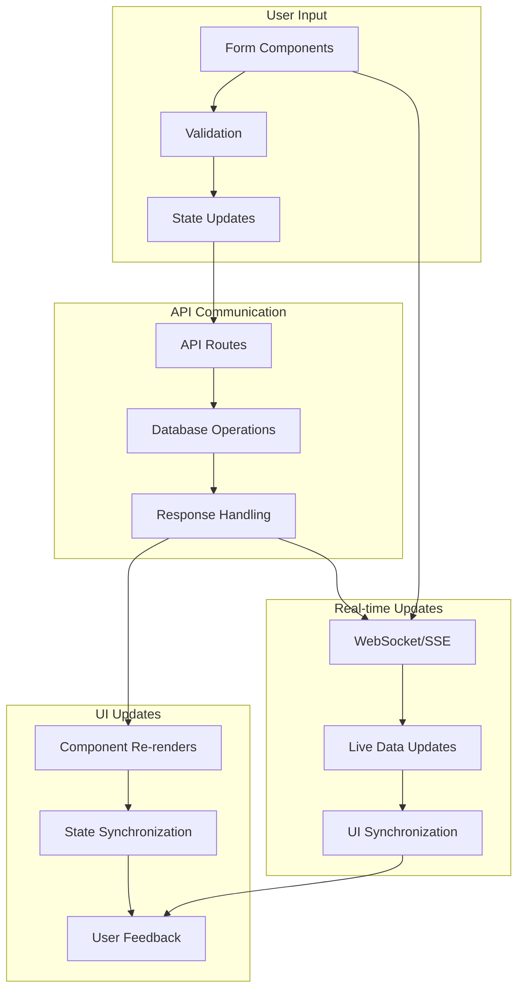

# Component Dependencies

## Dashboard Component Hierarchy

```mermaid
graph TD
    subgraph "Main Layout"
        A[layout.tsx] --> B[AuthProvider]
        A --> C[TenantProvider]
        A --> D[Toaster]
    end
    
    subgraph "Dashboard"
        E[dashboard/page.tsx] --> F[Header]
        E --> G[Sidebar]
        E --> H[ProjectSelector]
        E --> I[RecentWorkLogs]
        E --> J[LocationTracker]
        E --> K[ClockInCard]
    end
    
    subgraph "Admin Panel"
        L[admin/page.tsx] --> M[admin/people/page.tsx]
        L --> N[admin/tenants/page.tsx]
        L --> O[admin/settings/page.tsx]
    end
    
    subgraph "Task Management"
        P[tasks/page.tsx] --> Q[TaskList]
        P --> R[TaskForm]
        P --> S[TaskEditForm]
        P --> T[TaskAssignmentModal]
    end
    
    subgraph "UI Components"
        U[ui/button.tsx] --> V[ui/card.tsx]
        U --> W[ui/dialog.tsx]
        U --> X[ui/input.tsx]
        U --> Y[ui/select.tsx]
    end
    
    B --> E
    C --> E
    F --> U
    G --> U
    Q --> U
    R --> U
```

## State Management Flow

```mermaid
graph LR
    subgraph "Global State"
        A[Zustand Store] --> B[Tenant Context]
        B --> C[Auth Context]
    end
    
    subgraph "Component State"
        D[Local State] --> E[Form State]
        E --> F[UI State]
        F --> G[Data State]
    end
    
    subgraph "API State"
        H[API Calls] --> I[Loading States]
        I --> J[Error Handling]
        J --> K[Data Caching]
    end
    
    A --> D
    D --> H
    H --> A
```

## Data Flow Between Components

```mermaid
graph TB
    subgraph "User Input"
        A[Form Components] --> B[Validation]
        B --> C[State Updates]
    end
    
    subgraph "API Communication"
        C --> D[API Routes]
        D --> E[Database Operations]
        E --> F[Response Handling]
    end
    
    subgraph "UI Updates"
        F --> G[Component Re-renders]
        G --> H[State Synchronization]
        H --> I[User Feedback]
    end
    
    subgraph "Real-time Updates"
        J[WebSocket/SSE] --> K[Live Data Updates]
        K --> L[UI Synchronization]
    end
    
    A --> J
    F --> J
    L --> I
```
