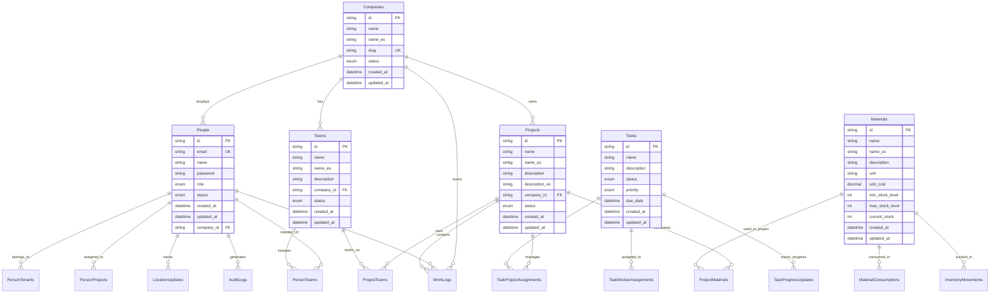

# Detailed Database Schema

## Entity Relationship Diagram


## Database Indexes
```sql
-- Performance optimization indexes
CREATE INDEX idx_people_email ON people(email);
CREATE INDEX idx_people_company_id ON people(company_id);
CREATE INDEX idx_projects_company_id ON projects(company_id);
CREATE INDEX idx_worklogs_person_id ON work_logs(person_id);
CREATE INDEX idx_worklogs_project_id ON work_logs(project_id);
CREATE INDEX idx_location_updates_person_id ON location_updates(person_id);
CREATE INDEX idx_audit_logs_person_id ON audit_logs(person_id);
CREATE INDEX idx_audit_logs_entity_type ON audit_logs(entity_type);
```

## Data Constraints
```sql
-- Foreign key constraints
ALTER TABLE people ADD CONSTRAINT fk_people_company 
    FOREIGN KEY (company_id) REFERENCES companies(id);

ALTER TABLE projects ADD CONSTRAINT fk_projects_company 
    FOREIGN KEY (company_id) REFERENCES companies(id);

ALTER TABLE teams ADD CONSTRAINT fk_teams_company 
    FOREIGN KEY (company_id) REFERENCES companies(id);

-- Check constraints
ALTER TABLE people ADD CONSTRAINT chk_people_role 
    CHECK (role IN ('WORKER', 'SUPERVISOR', 'ADMIN', 'SUPERUSER'));

ALTER TABLE projects ADD CONSTRAINT chk_projects_status 
    CHECK (status IN ('ACTIVE', 'COMPLETED', 'ON_HOLD', 'CANCELLED'));
```
