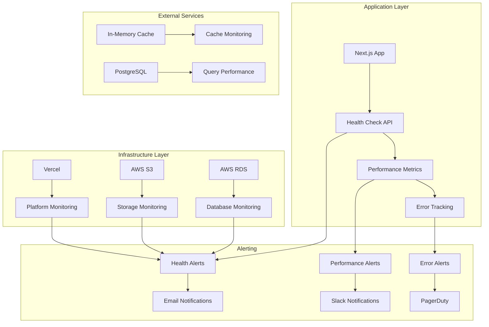

# Monitoring Architecture

## System Health Monitoring


## Metrics Collection
```typescript
// Health Check Endpoints
export async function GET() {
  const health = {
    status: 'healthy',
    timestamp: new Date().toISOString(),
    services: {
      database: await checkDatabase(),
      
      aws: await checkAWS(),
      external: await checkExternalServices()
    }
  };
  
  return Response.json(health);
}

// Performance Metrics
export const performanceMetrics = {
  responseTime: new Map(),
  throughput: new Map(),
  errorRate: new Map(),
  
  recordResponseTime(endpoint: string, time: number) {
    if (!this.responseTime.has(endpoint)) {
      this.responseTime.set(endpoint, []);
    }
    this.responseTime.get(endpoint).push(time);
  }
};
```

## Logging Strategy
```typescript
// Structured Logging
export const logger = {
  info: (message: string, meta?: any) => {
    console.log(JSON.stringify({
      level: 'info',
      message,
      timestamp: new Date().toISOString(),
      ...meta
    }));
  },
  
  error: (message: string, error?: Error, meta?: any) => {
    console.error(JSON.stringify({
      level: 'error',
      message,
      error: error?.stack,
      timestamp: new Date().toISOString(),
      ...meta
    }));
  }
};

// Audit Logging
export async function logAuditEvent(
  personId: string,
  action: string,
  entityType: string,
  entityId: string,
  oldValues?: any,
  newValues?: any
) {
  await prisma.auditLogs.create({
    data: {
      personId,
      action,
      entityType,
      entityId,
      oldValues: oldValues ? JSON.stringify(oldValues) : null,
      newValues: newValues ? JSON.stringify(newValues) : null
    }
  });
}
```

## Alerting Rules
```yaml
# Health Check Alerts
alerts:
  - name: "Database Down"
    condition: "database_status != 'healthy'"
    severity: "critical"
    notification: "pagerduty"
    
  - name: "High Response Time"
    condition: "avg_response_time > 2000ms"
    severity: "warning"
    notification: "slack"
    
  - name: "High Error Rate"
    condition: "error_rate > 5%"
    severity: "critical"
    notification: "pagerduty"
    
  - name: "Low Disk Space"
    condition: "disk_usage > 90%"
    severity: "warning"
    notification: "email"
```
