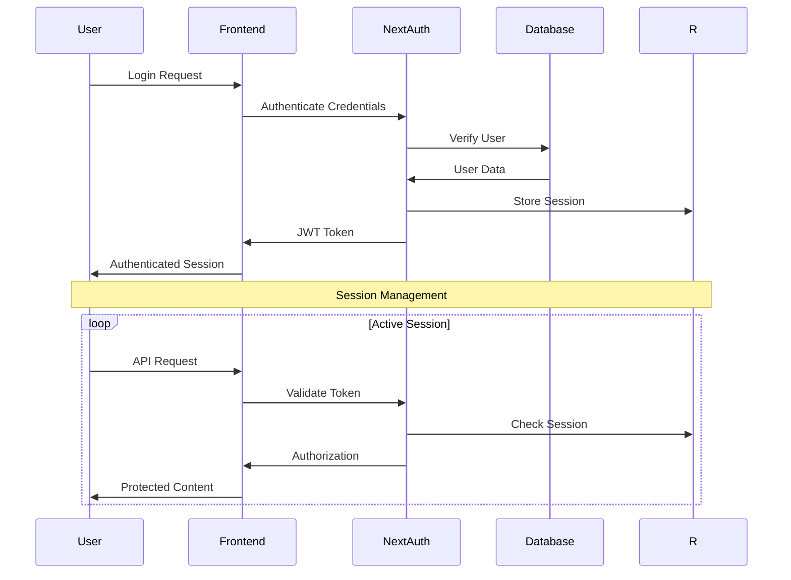
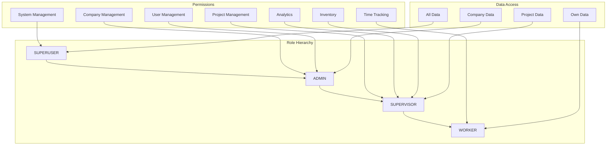

# Security Architecture

## Authentication Flow


## Authorization Matrix


## Security Measures
```typescript
// Password Security
const hashedPassword = await bcrypt.hash(password, 12);

// JWT Configuration
export const authOptions: NextAuthOptions = {
  jwt: {
    secret: process.env.NEXTAUTH_SECRET,
    maxAge: 60 * 60 * 24 * 30, // 30 days
  },
  session: {
    strategy: 'jwt',
    maxAge: 60 * 60 * 24 * 30, // 30 days
  }
};

// Rate Limiting
const rateLimit = {
  windowMs: 15 * 60 * 1000, // 15 minutes
  max: 100, // limit each IP to 100 requests per windowMs
  message: 'Too many requests from this IP'
};
```

## Data Protection
```typescript
// Input Sanitization
export function sanitizeInput(input: string): string {
  return DOMPurify.sanitize(input, { ALLOWED_TAGS: [] });
}

// SQL Injection Prevention
const user = await prisma.people.findUnique({
  where: { id: userId }, // Parameterized query
  select: { name: true, email: true }
});

// XSS Prevention
const safeContent = DOMPurify.sanitize(userInput, {
  ALLOWED_TAGS: ['b', 'i', 'em', 'strong'],
  ALLOWED_ATTR: []
});
```
