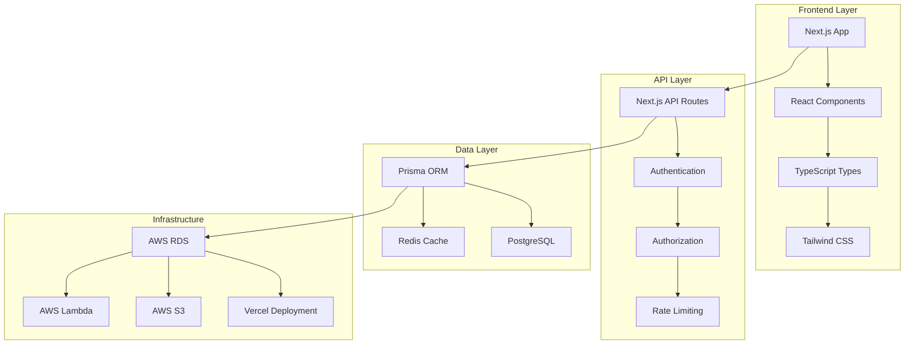
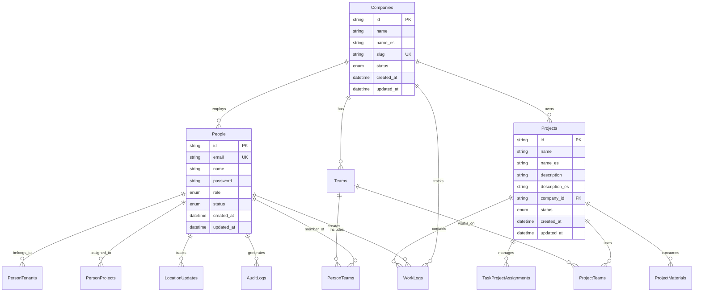
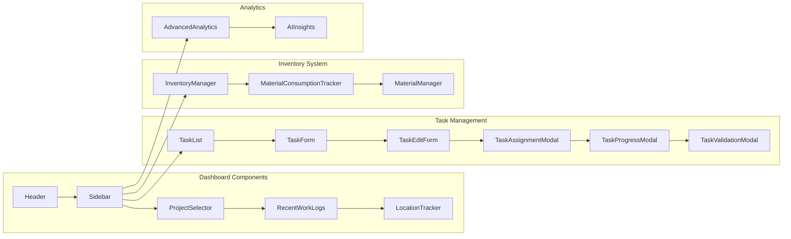
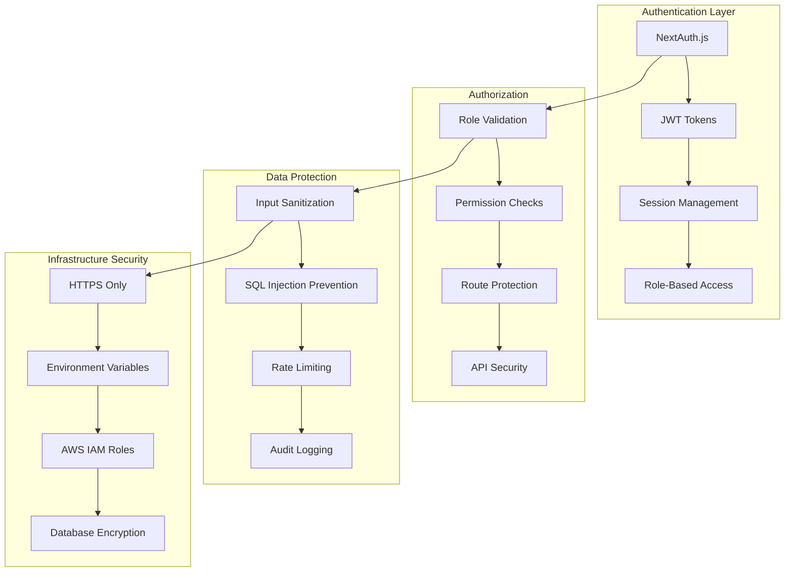
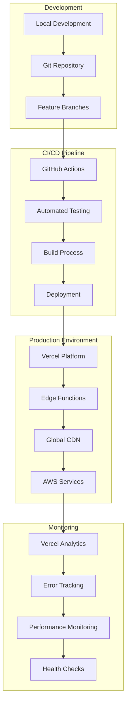
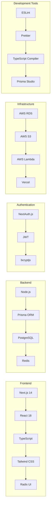
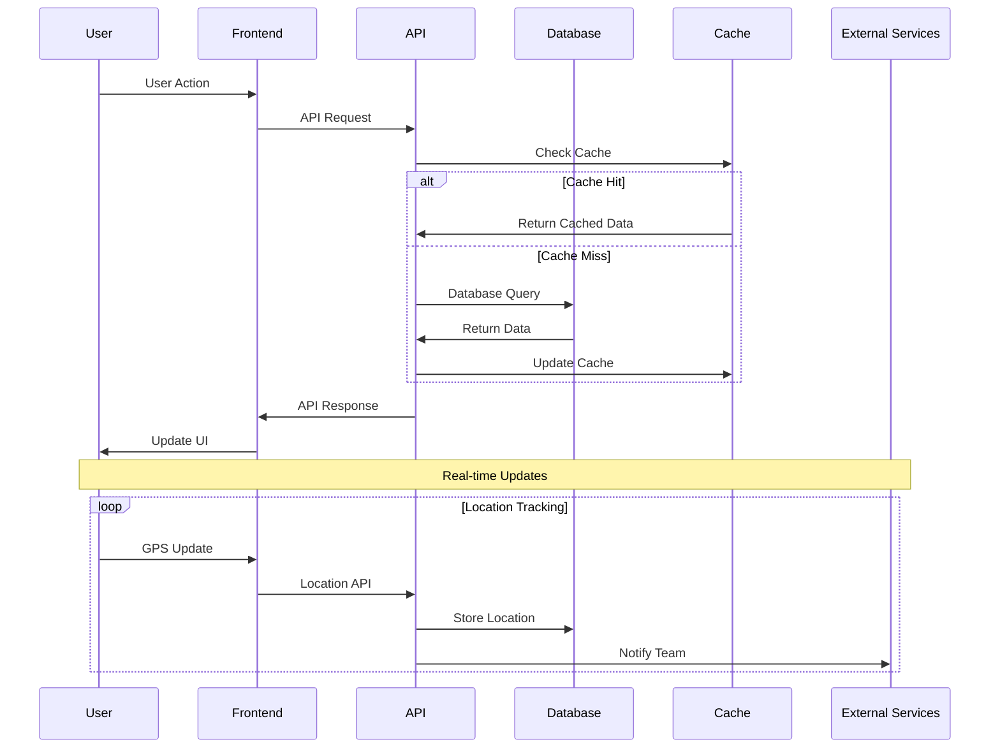
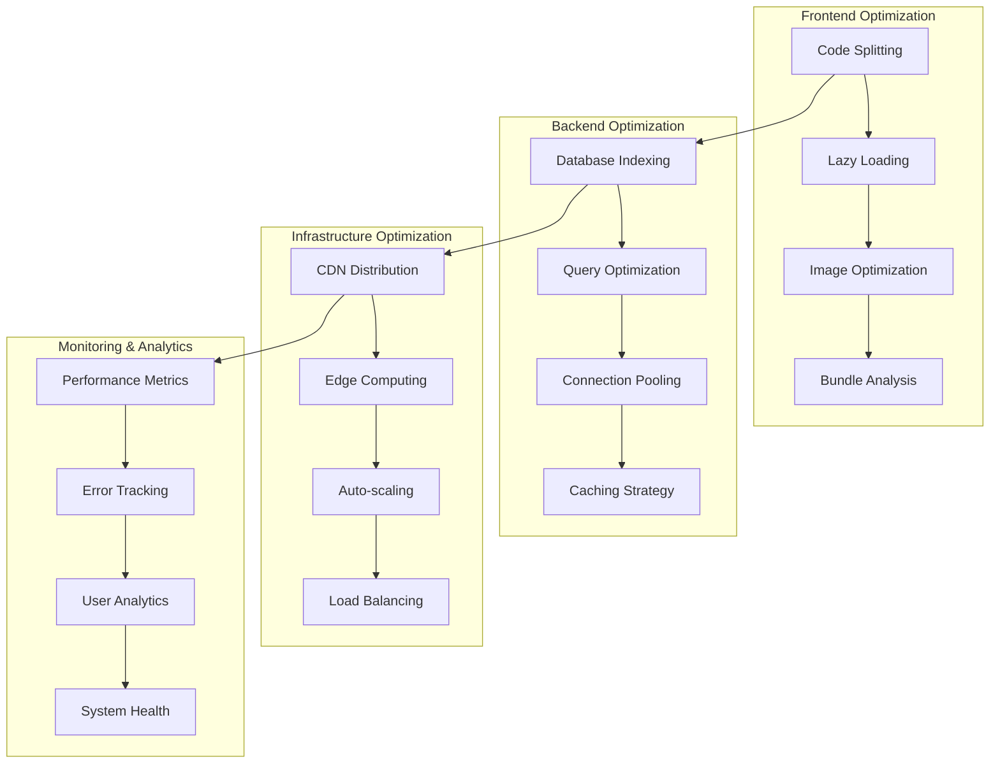

# IngePro System Architecture

## High-Level System Overview


## Database Schema Architecture


## Component Architecture


## API Endpoint Architecture
```mermaid
graph TD
    subgraph "Authentication"
        A1[/api/auth/...nextauth] --> A2[Login/Logout]
        A3[/api/auth/set-password] --> A4[Password Management]
        A5[/api/auth/refresh-company] --> A6[Company Context]
    end
    
    subgraph "Core Business Logic"
        B1[/api/projects] --> B2[Project CRUD]
        B3[/api/tasks] --> B4[Task Management]
        B5[/api/people] --> B6[User Management]
        B7[/api/teams] --> B8[Team Operations]
    end
    
    subgraph "Workflow Management"
        C1[/api/worklog] --> C2[Time Tracking]
        C3[/api/location] --> C4[GPS Tracking]
        C4[/api/location/batch] --> C5[Batch Updates]
    end
    
    subgraph "Inventory & Materials"
        D1[/api/materials] --> D2[Material CRUD]
        D3[/api/inventory/movements] --> D4[Stock Movements]
        D5[/api/inventory/reorder-requests] --> D6[Reorder Management]
    end
    
    subgraph "Analytics & Insights"
        E1[/api/analytics] --> E2[Business Metrics]
        E3[/api/ai-insights] --> E4[AI-Powered Analysis]
        E5[/api/analytics/superuser-stats] --> E6[System Statistics]
    end
    
    subgraph "System Operations"
        F1[/api/system-health] --> F2[Health Monitoring]
        F3[/api/cron/rate-limit-cleanup] --> F4[Maintenance Tasks]
        F5[/api/health] --> F6[Status Checks]
    end
```

## Security Architecture


## Deployment Architecture


## Technology Stack


## Data Flow Architecture


## Performance Optimization

